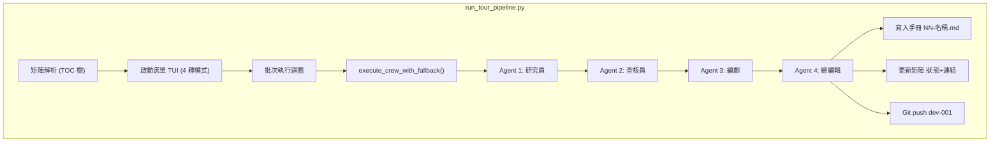
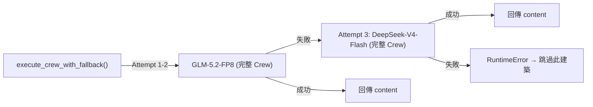
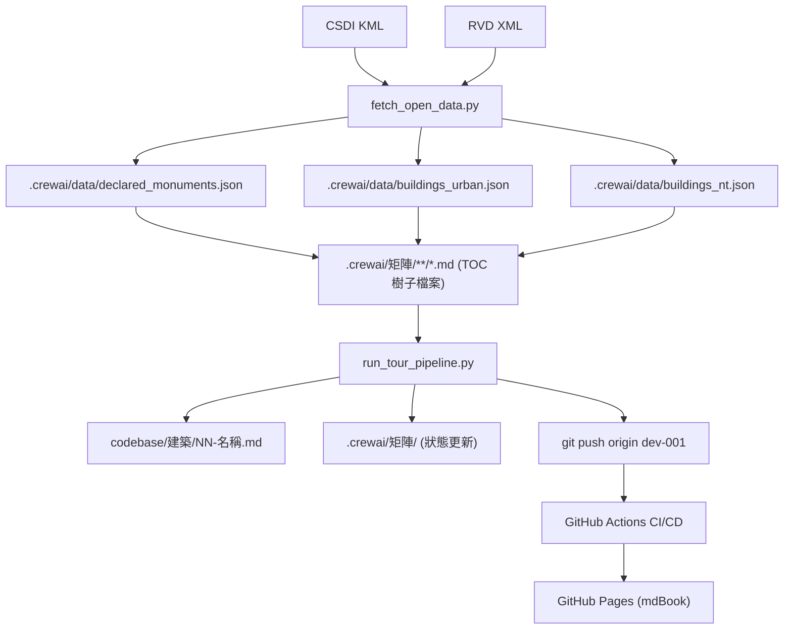

# 初步設計審查 (PDR)

## 1. 系統架構

### 1.1 管線架構



### 1.2 LLM 備援策略



### 1.3 CI/CD 流程

```plantuml
@startuml
!theme plain
skinparam componentStyle rectangle

package "GitHub Actions CI/CD" {
    component "auto_merge" as AM
    component "codeql" as CQ
    component "sonarqube" as SQ
    component "build" as BD
    component "deploy" as DP

    AM : dev-001 → dev → main
    CQ : CodeQL 安全分析
    SQ : SonarQube 品質掃描
    BD : mdBook 建置
    DP : GitHub Pages 部署
}

cloud "push to dev-001" as push
push --> AM
push --> CQ
push --> SQ

cloud "workflow_dispatch" as manual
manual --> BD
manual --> CQ
manual --> SQ

BD --> DP
CQ --> DP
SQ --> DP

DP --> cloud "GitHub Pages" as pages
@enduml
```

## 2. 模組設計

### 2.1 `fetch_open_data.py`

| 函式 | 職責 |
| :--- | :--- |
| `fetch_declared_monuments()` | 下載 CSDI KML 法定古蹟資料 |
| `fetch_urban_buildings()` | 下載 RVD Urban XML 樓宇資料 |
| `fetch_nt_buildings()` | 下載 RVD NT XML 樓宇資料 |

輸出：`.crewai/data/declared_monuments.json`、`buildings_urban.json`、`buildings_nt.json`

### 2.2 `run_tour_pipeline.py`

| 函式 | 職責 |
| :--- | :--- |
| `parse_and_sort_building_matrix()` | 解析 TOC 樹子檔案，排序建築清單 |
| `update_matrix_entry()` | 依編號 N 更新矩陣狀態與連結 |
| `get_primary_llm()` / `get_fallback_llm()` | 初始化 LLM 實例 |
| `preflight_llm_check()` | LLM 連線預檢（max_tokens=1） |
| `execute_crew_with_fallback()` | 三階段重試策略，回傳 `(content, model_label)` |
| `build_agents()` / `build_tasks()` | 構建 CrewAI 代理人與任務 |
| `auto_git_commit_and_push()` | Git 自動化 |
| `_sanitize_filename()` | 檔名清理（保留 CJK + ASCII） |
| `_category_to_subdir()` | 類別對應子目錄 |
| `main()` | 主流程入口 |

### 2.3 `build_mdbook.py`

從矩陣及已生成的手冊清單動態產生 mdBook `SUMMARY.md`（`book-src/` 目錄），再由 `mdbook build` 編譯為靜態網站。

## 3. 資料流



## 4. 設計決策

| 決策 | 理由 |
| :--- | :--- |
| TOC 樹矩陣拆分 | 單一檔案含 20,210 行過大，依類別拆分為 3 子檔案 |
| 編號 N 為子檔案內獨立 | 避免全域編號管理複雜度，以子目錄區分 |
| 三階段重試（非混合 LLM） | 簡化邏輯，避免同一 Crew 內不同 Agent 使用不同 LLM 的狀態不一致 |
| musllinux stub 套件 | crewai 依賴無 musllinux wheel，本專案不使用 Memory/RAG/Flow，stub 安全 |
| SSL bypass | HKO 端點憑證未受 sandbox 系統 CA 信任 |
| 歷史檔案連結動態產出 | 確保連結由 AI 研究員即時搜集驗證，不預設寫死 |
| GITHUB_TOKEN 認證 | 避免 PAT 複雜度；GITHUB_TOKEN push 不觸發級聯 workflow |

## 5. 風險與緩解

| 風險 | 影響 | 緩解措施 |
| :--- | :--- | :--- |
| GLM-5.2-FP8 reasoning token 耗盡 | 部分 Handbook 生成失敗 | 三階段重試 + DeepSeek 備援 |
| 20,210 棟建築生成耗時極長 | 專案完成時間不可預期 | `--priority-first` 優先處理重要建築 |
| HKO 端點不穩定 | 管線中斷 | 例外捕獲 + `continue` 跳過，不中斷 |
| musllinux 相依性問題 | 環境建置失敗 | stub 套件 + uv 鎖定 |
